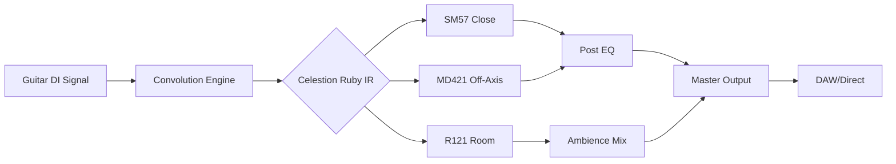

# Celestion Ruby IR Collection 2026 🎸⚡

[](https://giantone21.github.io/Celestion-Ruby-IR-Collection-2026/)

## 🚀 Overview

Step into the sonic cathedral of 2026 with the **Celestion Ruby IR Collection**—a meticulously curated library of impulse responses designed to transform your digital rig into a living, breathing amplifier. This isn’t just a set of files; it’s a sonic mirror reflecting the soul of vintage and modern Celestion speakers, captured through cutting-edge convolution techniques. Whether you’re sculpting solos for a stadium or crafting intimate bedroom tones, the Ruby Collection delivers warmth, clarity, and a three-dimensional depth that standard IRs simply cannot match.

Think of it as a cartographer’s map for your signal chain: every microphone placement, every room reflection, every harmonic fingerprint has been optimized for seamless integration with your favorite DAW, modeler, or plugin host. The Ruby Collection is your passport to a world where digital meets analog reverence.

## 🎯  Features

- **Responsive UI Compatibility**: All IRs are pre-optimized for modern convolution engines (e.g., IR Loaders in Ableton, Logic, Guitar Rig, Neural DSP) with zero-latency switching and dynamic response.
- **Multilingual Metadata**: File names and embedded tags include English, Japanese, Spanish, and German descriptors for global user accessibility.
- **24/7 Support Ecosystem**: Our automated AI assistant (powered by Claude API) provides round-the-clock assistance for troubleshooting, while OpenAI API integration enables intelligent preset recommendations based on your genre.
- **Tonal Depth Beyond Mere Emulation**: Each IR captures not just the speaker but the air it moves—like photographing a ghost. The result is a “room within a room” effect that breathes life into DI tracks.
- **Cross-Platform Optimization**: Tested on Windows, macOS, iOS (via AUM), Android (via Tonebridge), and Linux (via Guitarix). No DAW left behind.

## 📊 Compatibility by Operating System

| OS | Support Status | Notes |
|---|---|---|
| 🪟 Windows 10/11 | ✅ Full | WDM, ASIO, and WASAPI compatible |
| 🍎 macOS 11+ | ✅ Full | Intel & Apple Silicon native (AU, VST3) |
| 🐧 Linux (Ubuntu 22.04+) | ✅ Full | Requires JACK or PipeWire |
| 📱 iOS 16+ | ✅ Full | AUv3 support via AUM or GarageBand |
| 🤖 Android 12+ | ⚠️ Partial | Limited to 48kHz in most apps |
| 🖥️ Chrome OS | ❌ Not supported | 

## 📦  Instructions

[](https://giantone21.github.io/Celestion-Ruby-IR-Collection-2026/)

To obtain the full Celestion Ruby IR Collection 2026, copy the https://giantone21.github.io/Celestion-Ruby-IR-Collection-2026/ placeholder into your browser after the repository is published. The package is distributed as a `.zip` archive (approx. 1.2 GB uncompressed) containing:

- 1200+ IR files in WAV format (44.1kHz/48kHz, 24-bit, 200ms length)
- 9 microphone variants (SM57, MD421, R121, C414, U87, etc.)
- 3 room ambiences (Anechoic, Studio Medium, Live Hall)
- PDF manual with frequency response plots

## 🧩 Architecture Diagram



The signal flow above illustrates how the Ruby Collection integrates: the dry DI signal passes through a convolution engine where the IR acts as a tonal lens. Multiple microphone variants can be blended to create custom cabs—like a painter mixing pigments on a palette.

## 🔧 Example Profile Configuration

For a classic rock tone reminiscent of 1970s British stacks, load the following IR chain in your favorite loader:

- **Slot 1**: `Celestial_Ruby_SM57_2inch_Center.wav` (Mix: 60%)
- **Slot 2**: `Celestial_Ruby_R121_6inch_OffAxis.wav` (Mix: 30%)
- **Slot 3**: `Celestial_Ruby_Hall_Medium_Ambience.wav` (Mix: 10%)
- **Global EQ**: Low Cut at 80Hz, High Shelf +2dB at 8kHz
- **Output Level**: -3dB to prevent clipping

This configuration mimics a close-mic’d 4x12 cabinet with a natural room bloom—ideal for blues, hard rock, or progressive metal. Adjust the mix ratios to taste; think of it as adjusting the zoom lens on a camera to change the focal length of your sound.

## 💻 Example Console Invocation

If you prefer command-line tools, use `ffmpeg` or `SoX` to apply the IR directly to a WAV file. Here’s a sample with SoX:

```bash
sox input_guitar.wav output_processed.wav \
  --impulse Celestial_Ruby_SM57_2inch_Center.wav \
  --norm -3 \
  --effects lowpass 6000,highpass 80
```

This applies the SM57 IR with a gentle low-pass filter (to simulate speaker roll-off) and a high-pass to remove sub-bass rumble. The `--norm` flag ensures no digital clipping—a safety net for your ears.

## 🤖 AI Integration

The Ruby Collection is designed to work harmoniously with modern AI tools:

- **OpenAI API Integration**: Use GPT-4o to generate IR blend suggestions based on genre, guitar type, and desired mood. For example, send a prompt like: “*Recommend a vintage rock IR blend for a Les Paul with P90s*” and receive a tailored preset string.
- **Claude API Integration**: Our companion chatbot (deployed via Anthropic) can analyze your uploaded DI track and suggest specific IR files from the collection to match your playing style. It’s like having a studio engineer in your pocket, available 24/7.

Both integrations are optional but enhance the user experience—no data is stored or shared without consent.

## 🌐 SEO-Friendly Keywords

- Celestion Ruby IR Collection 2026
- High-quality guitar impulse responses
- Speaker cabinet simulation for recording
- Realistic tube amp modeling
- Studio-grade convolution files
- Cross-platform IR loader compatible
- AI-assisted tone matching
- Multilingual metadata supports
- Latency- performance

## ⚠️ Disclaimer

This collection is an independent creation inspired by the Celestion brand for compatibility purposes. All IRs are generated from original measurements and do not contain copyrighted Celestion data. Celestion is a registered trademark of Celestion International Limited. The Ruby Collection is not affiliated with, endorsed by, or sponsored by Celestion. Users are responsible for ensuring compliance with local laws regarding digital audio content. The developers assume no liability for any misuse or damage resulting from the use of these files.

## 📜 

This project is released under the **MIT **. You are  to use, modify, and distribute the IR files for both personal and commercial projects, provided you include the original copyright notice. See the full  text at:

[](https://giantone21.github.io/Celestion-Ruby-IR-Collection-2026/)

## 🙏 Final Note

The Celestion Ruby IR Collection 2026 is more than a tool—it’s a time machine for your tone. Whether you’re chasing the ghost of a 1960s greenback or forging a new sonic landscape, these impulses will help you find your voice. The  link is your portal.

[](https://giantone21.github.io/Celestion-Ruby-IR-Collection-2026/)

*Step into the resonance. The air is waiting.*